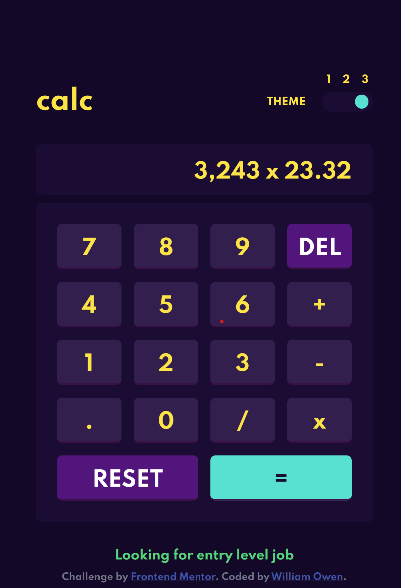

# Frontend Mentor - Calculator app solution

This is a solution to the [Calculator app challenge on Frontend Mentor](https://www.frontendmentor.io/challenges/calculator-app-9lteq5N29). Frontend Mentor challenges help you improve your coding skills by building realistic projects. 

---
<br>

## Table of contents


  - [Overview](#overview)
    - [The challenge](#the-challenge)
    - [Screenshot](#screenshot)
    - [Links](#links)
  - [My process](#my-process)
    - [Built with](#built-with)
    - [What I learned](#what-i-learned)
    - [Continued development](#continued-development)
    - [Useful resources](#useful-resources)
  - [Author](#author)
  - [Acknowledgments](#acknowledgments)
<br><br><br>
---
<br>

## Overview

### The challenge

Users should be able to:

- See the size of the elements adjust based on their device's screen size
- Perform mathematical operations like addition, subtraction, multiplication, and division
- Adjust the color theme based on their preference
- **Bonus**: Have their initial theme preference checked using `prefers-color-scheme` and have any additional changes saved in the browser
<br><br><br>

# Screenshot

<br> 

<!--  -->


### Links


- Live Site URL: [Click here to visit!](https://williamowen65.github.io/calculator-app-main/dist/)
- View the code: [GitHub](https://github.com/williamowen65/calculator-app-main)
  
<br><br><br>
## My process

Step one - Get one layout and theme<br>
Step two - Figure out how to do math<br>
Step three - Configure themes

<br>

### Built with ... 

- OOP
- Lodash
- exact-math
- prefers-color-scheme

<br><br><br>

### What I learned...

Keep it simple. And don't be afraid to try something new.
<br><br><br>

### As you can see, I chose a simple way achieve order
```html
<form class="keys">
    <input type="button" value="7">
    <input type="button" value="8">
    <input type="button" value="9">
    <input type="button" value="del" class="del">
    <input type="button" value="4">
    <input type="button" value="5">
    <input type="button" value="6">
    <input type="button" value="+">
    <input type="button" value="1">
    <input type="button" value="2">
    <input type="button" value="3">
    <input type="button" value="-">
    <input type="button" value=".">
    <input type="button" value="0">
    <input type="button" value="/">
    <input type="button" value="x">
    <input type="button" value="reset" class="reset">
    <input type="submit" value="=" class="submit">
  </form>
```

### I found a way to implement prefers-color-scheme against a custom localStorage variable

```css
:root{
  .theme1{
   @include theme1;
  }
  .theme2{
    @include theme2;
  }
  .theme3{
    @include theme3;
  }
  @media(prefers-color-scheme: dark){
    .theme3{
      @include theme3
    }
  }
  @media(prefers-color-scheme: light){
    .theme2{
      @include theme2
    }
  }
}
```

### Proudly reaping the benefits from OOP

```js
import Calculator from "./objects/Calculator"
 
const el = document.querySelector('.calc');
const myCalc = new Calculator(el)

```

### Continued development

I realized that I should have done this project with typescript in hindsight.

### Useful resources

- [DesignCourse](https://www.youtube.com/watch?v=kVKuH5H7nuA&t=236s) - I learned how to use the css 'prefers-color-scheme' for this project by watching this video 


## Author

- Website - [William Owen](https://web-dev-portfolio-react.web.app/)
- Frontend Mentor - [@williamowen65](https://www.frontendmentor.io/profile/williamowen65)
- LinkedIn - [@webdevpreneur29](https://www.linkedin.com/in/webdevpreneur29/)

